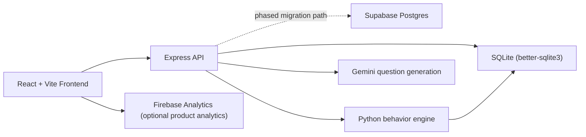

# Quizzi

Quizzi is a live classroom quiz platform built for teachers who want more than a score screen. It combines pack generation from uploaded learning material, live hosting, deep post-game analytics, student drill-down dashboards, and adaptive follow-up practice built from the same source content.

The system is designed to keep language-model usage narrow and deliberate:
- LLMs are used for question generation from uploaded material.
- Analytics, scoring, telemetry interpretation, dashboard summaries, and adaptive practice selection are computed deterministically in Python and TypeScript.

## What The Product Does

- Create quiz packs from uploaded text, PDF, DOCX, or manually edited material.
- Host live sessions with a 6-digit PIN and real-time student join flow.
- Support multiple game modes, including team-based classroom play.
- Track answer accuracy and behavioral telemetry during the game.
- Generate BI-style class dashboards and per-student drill-down analytics.
- Build adaptive follow-up games for specific students from the same material.
- Export analytics and research-oriented CSV datasets.

## Core Capabilities

### Teacher workflow

1. Upload material or paste source text.
2. Generate or edit questions.
3. Launch a live session.
4. Monitor the host lobby and live room state.
5. Review class analytics after the game.
6. Open any student dashboard for detailed behavioral analysis.
7. Generate a targeted follow-up game or practice set.

### Student workflow

1. Enter the homepage.
2. Join with a game PIN and nickname.
3. Play the live session.
4. Revisit their own dashboard and practice recommendations.

### Analytics workflow

- Class-level dashboard with performance, stress, pace, question pressure, topic mastery, correlations, outliers, and CSV export.
- Student-level dashboard with session-vs-overall comparison, weak tags, confidence/focus signals, question review, and adaptive recommendations.
- Research-oriented telemetry rows generated from answer and interaction data.

## Architecture



## Stack

- Frontend: React 19, Vite, React Router, Tailwind, Motion
- Backend: Express, TypeScript
- Database: SQLite via `better-sqlite3`, with phased Supabase Postgres support for migration
- Analytics engine: Python
- Question generation: Gemini via `@google/genai`
- Product analytics: Firebase Analytics

## Repository Structure

```text
src/
  client/
    components/
    lib/
    pages/
  server/
    db/
    routes/
    services/
  shared/
python/
scripts/
server.ts
```

Important files:

- [`server.ts`](server.ts): Express entrypoint, security headers, JSON limits, Vite/static serving.
- [`src/server/routes/api.ts`](src/server/routes/api.ts): API routes for auth, pack generation, sessions, analytics, practice, telemetry.
- [`src/server/db/index.ts`](src/server/db/index.ts): SQLite schema, migrations, seed data, showcase seed.
- [`src/server/services/teacherUsers.ts`](src/server/services/teacherUsers.ts): secure teacher registration and password verification.
- [`src/server/services/materialIntel.ts`](src/server/services/materialIntel.ts): token-saving material compression and generation cache.
- [`python/behavior_engine.py`](python/behavior_engine.py): deterministic scoring, telemetry interpretation, dashboards, adaptive practice logic.

## Local Development

### Prerequisites

- Node.js 20+ recommended
- Python 3.10+ recommended
- `npm`

Node 18 can still run the project in some environments, but several dependencies now expect Node 20+.

### Setup

1. Install dependencies:

```bash
npm install
```

2. Copy environment variables:

```bash
cp .env.example .env
```

3. Fill in the required values in `.env`:

- `GEMINI_API_KEY`
- optional Firebase analytics keys

4. Start the app:

```bash
npm run dev
```

5. Open:

```text
http://localhost:3000
```

The SQLite database file `quizzi.db` is created automatically in the project root. Demo data and analytics showcase data are seeded on server startup.

### Optional: prepare Supabase Postgres

If you want to phase the backend into Supabase Postgres without breaking the existing runtime:

1. Fill `DATABASE_URL` and/or `DIRECT_URL` in `.env`.
2. Bootstrap the schema:

```bash
npm run db:bootstrap:supabase
```

3. Copy the current SQLite snapshot into Supabase:

```bash
npm run db:migrate:sqlite-to-supabase
```

4. Optional but recommended: run [`supabase/rls.sql`](supabase/rls.sql) in the Supabase SQL Editor before exposing the publishable key to browser code.

The app still uses SQLite as the live source of truth today. The Supabase path is added so the database can be validated and migrated safely before a full runtime cutover.

## Environment Variables

| Variable | Required | Purpose |
|---|---:|---|
| `GEMINI_API_KEY` | Yes | Gemini API access for question generation |
| `APP_URL` | No | External app URL when deployed |
| `VITE_FIREBASE_API_KEY` | No | Firebase web config for product analytics |
| `VITE_FIREBASE_AUTH_DOMAIN` | No | Firebase web config |
| `VITE_FIREBASE_PROJECT_ID` | No | Firebase web config |
| `VITE_FIREBASE_STORAGE_BUCKET` | No | Firebase web config |
| `VITE_FIREBASE_MESSAGING_SENDER_ID` | No | Firebase web config |
| `VITE_FIREBASE_APP_ID` | No | Firebase web config |
| `VITE_FIREBASE_MEASUREMENT_ID` | No | Firebase analytics measurement ID |
| `NEXT_PUBLIC_SUPABASE_URL` | No | Supabase project URL for future client integration |
| `NEXT_PUBLIC_SUPABASE_PUBLISHABLE_DEFAULT_KEY` | No | Supabase publishable key |
| `EXPO_PUBLIC_SUPABASE_URL` | No | Supabase project URL for the Expo client |
| `EXPO_PUBLIC_SUPABASE_KEY` | No | Supabase publishable key for the Expo client |
| `VITE_SUPABASE_URL` | No | Supabase URL exposed to the Vite client |
| `VITE_SUPABASE_PUBLISHABLE_KEY` | No | Supabase publishable key exposed to the Vite client |
| `SUPABASE_SECRET_KEY` | No | Server-only Supabase secret key for admin REST access |
| `DATABASE_URL` | No | Pooled Supabase Postgres connection string |
| `DIRECT_URL` | No | Direct Supabase Postgres connection string for schema and migration |
| `SQLITE_DB_PATH` | No | Override the local SQLite file used during migration |

## Authentication

Teacher access is protected with server-issued signed cookies and teacher-only route guards.

### Working options

- Email/password sign-up
- Email/password sign-in
- Demo teacher account

### Demo account

- Email: `mail@mail.com`
- Password: `123123`

### Current status of social sign-in

Google and Facebook buttons are present in the UI, but real provider sign-in is not configured yet. The current Firebase project also does not allow email/password sign-up through Firebase Auth, so teacher registration is handled securely on the app server instead.

## Security Notes

- Signed `HttpOnly` teacher session cookies
- Server-side protection for teacher routes
- Origin checks on state-changing requests
- In-memory rate limiting on auth and classroom actions
- Upload allowlist and size limits
- Password hashing for registered teachers
- Security headers enabled in Express
- Runtime database and cache artifacts excluded from git

## Telemetry And Analytics

Quizzi captures more than correctness. During live play it can record metrics such as:

- response time
- time to first interaction
- final decision buffer
- answer swaps
- panic swaps
- focus loss count
- idle time
- blur time
- interaction counts
- same-answer reclicks
- option dwell patterns

These are converted into deterministic higher-level signals such as:

- stress index
- confidence score
- focus score
- decision volatility
- pace label
- attention drag
- momentum
- segment-level session patterns
- question diagnostics
- class-level correlations and outliers

## Game Modes

The platform currently supports multiple session modes, including:

- `classic_quiz`
- `team_relay`
- `peer_pods`
- `mastery_matrix`

Team-based modes automatically assign students to teams and expose team analytics in the live host and post-game dashboards.

## Token Efficiency Strategy

To reduce model cost without lowering product quality, Quizzi compresses source material before generation:

- source text is normalized and profiled
- excerpts, key points, and topic fingerprints are derived deterministically
- generation requests are cached by material hash and generation parameters
- packs expose token-savings metadata in the UI

This keeps the LLM focused on question generation while the rest of the platform remains deterministic.

## Scripts

```bash
npm run dev
npm run build
npm run lint
npm run clean
npm run seed:analytics-showcase
python3 -m py_compile python/behavior_engine.py python/behavior_engine_cli.py
```

## Demo And Showcase Data

The app seeds:

- general demo content for immediate local use
- a realistic analytics showcase session for dashboard evaluation

This makes it possible to inspect a rich “already played” classroom dashboard without manually simulating a full class first.

## Known Limitations

- Social sign-in is not configured yet.
- Some teacher analytics routes still need deeper per-teacher scoping beyond the main teacher overview and newly created packs.
- The production bundle is currently large and would benefit from code splitting.
- Firebase is used for product analytics only, not as the source of truth for auth.

## Verification

Useful checks before pushing changes:

```bash
npm run lint
npm run build
npm run db:bootstrap:supabase
npm run db:migrate:sqlite-to-supabase
```

```bash
npm run lint
npm run build
python3 -m py_compile python/behavior_engine.py python/behavior_engine_cli.py
```

## Deployment Notes

- The app runs as a single Express server that serves both API routes and the Vite-built frontend.
- In development, Vite runs in middleware mode through `server.ts`.
- In production, the server serves the `dist/` build output.

## Summary

Quizzi is not just a quiz launcher. It is a teaching workflow that starts with source material, runs through live classroom interaction, and ends with actionable behavioral analytics and adaptive follow-up for each student.
