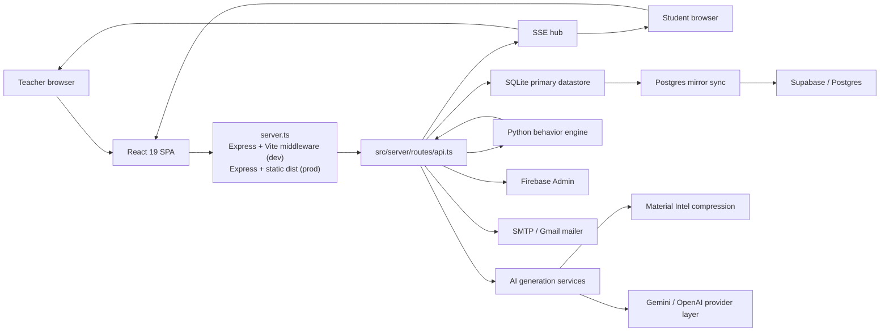
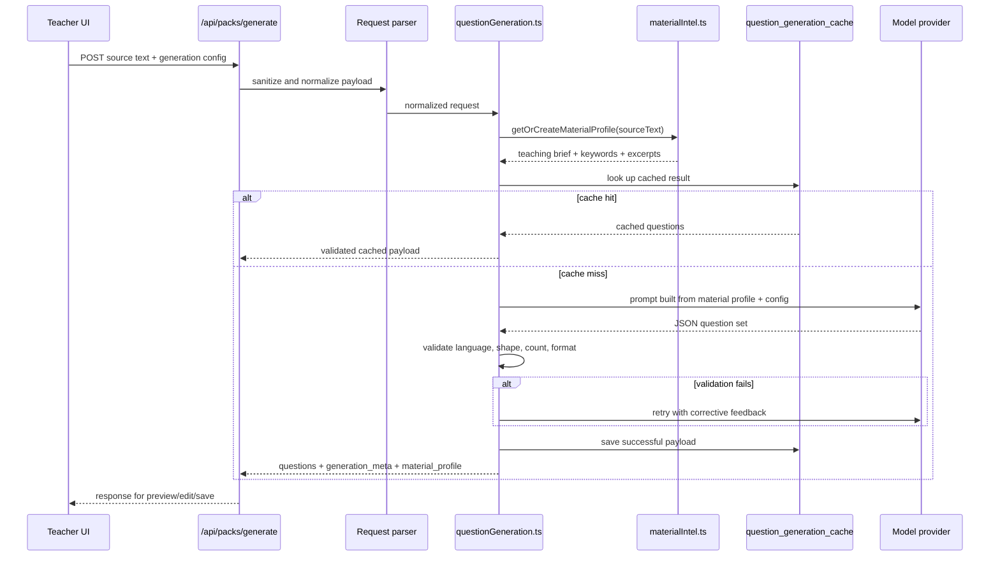
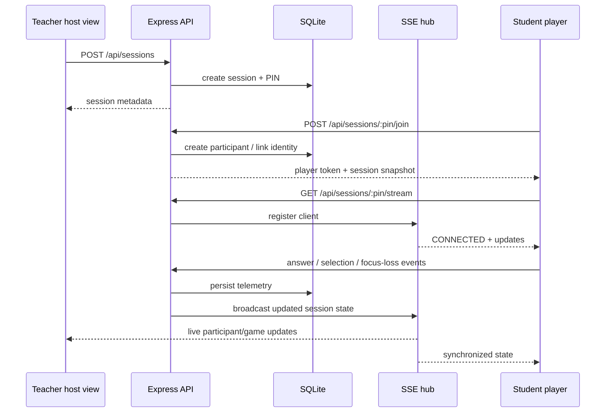
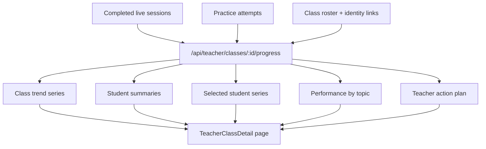
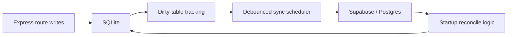

# Quizzi

Quizzi is a full-stack classroom platform for:

- creating quiz packs from source material with AI
- running live classroom game sessions
- capturing behavioral telemetry during play
- analyzing class and student performance in real time and over time
- giving students follow-up practice and memory-oriented remediation

This repository contains the entire product in one codebase:

- a React 19 single-page app
- an Express server that also hosts Vite in development
- a SQLite primary datastore with an optional Supabase/Postgres mirror
- Firebase-based Google sign-in
- a Python behavior engine for deterministic analytics
- an AI question-generation pipeline with provider/model selection, retry, validation, caching, and improvement mode

The current codebase is not just a prototype UI. It already includes the teacher workflow, student workflow, live sessions, rostered classes, class progress over time, adaptive practice, AI pack generation, and production safety checks.

## Table of contents

- [What the product does](#what-the-product-does)
- [Key capabilities](#key-capabilities)
- [Architecture overview](#architecture-overview)
- [Main flows](#main-flows)
- [Repository structure](#repository-structure)
- [Tech stack](#tech-stack)
- [Runtime and deployment model](#runtime-and-deployment-model)
- [Data and persistence model](#data-and-persistence-model)
- [Authentication model](#authentication-model)
- [AI question generation pipeline](#ai-question-generation-pipeline)
- [Live gameplay and telemetry pipeline](#live-gameplay-and-telemetry-pipeline)
- [Longitudinal progress analytics](#longitudinal-progress-analytics)
- [Routes and screens](#routes-and-screens)
- [API surface](#api-surface)
- [Environment variables](#environment-variables)
- [Local development](#local-development)
- [Scripts](#scripts)
- [Operational notes](#operational-notes)
- [Troubleshooting](#troubleshooting)
- [Practical reading guide](#practical-reading-guide)

## What the product does

Quizzi is built around a simple teacher-to-student workflow:

1. A teacher creates or edits a quiz pack.
2. The pack can be written manually or generated from raw source material with AI.
3. The teacher launches a live classroom session.
4. Students join with a PIN and submit answers while the system captures timing, changes of mind, focus loss, and other signals.
5. The server stores the session, streams live state with SSE, and computes analytics.
6. The teacher reviews class analytics, student drill-down, class retention signals, and long-term progress graphs.
7. Students receive practice and follow-up experiences based on performance and memory signals.

The system is therefore both:

- a live quiz platform
- an analytics platform for teaching decisions

## Key capabilities

### Teacher-facing

- AI-assisted pack generation from raw text
- improvement mode for rewriting an existing set of questions
- quiz pack versioning and duplication
- class creation, roster management, and pack assignment
- email-based student invites
- live host view for running a session
- real-time class analytics
- per-student drill-down analytics
- reports and LMS export endpoints
- long-term class progress workspace with:
  - class trend graph
  - student search
  - student-specific trend graph
  - student comparison
  - topic-level performance
  - teacher action-plan insights

### Student-facing

- account-based student auth
- Google sign-in support
- class acceptance and student portal
- live join/play flow using session PIN
- student dashboard/history
- adaptive practice and follow-up practice
- progress visibility across class and practice history

### System-level

- one-process development server for API + SPA
- SQLite for local speed and simplicity
- optional Supabase/Postgres mirror for durability and production migration
- Firebase Admin verification on the backend
- Python behavior engine for deterministic analytics
- provider/model abstraction for AI generation
- retry and validation contracts for AI outputs
- in-flight dedupe for generation requests
- SSE fan-out with connection caps and heartbeat
- origin checks, rate limiting, security headers, and startup safety warnings

## Architecture overview



## Main flows

### 1. AI pack creation flow



### 2. Live classroom session flow



### 3. Longitudinal progress flow



## Repository structure

This is the practical structure of the repo, trimmed to the parts that matter most:

```text
.
├── .env.example
├── server.ts
├── python/
│   ├── behavior_engine.py
│   └── behavior_engine_cli.py
├── scripts/
│   ├── bootstrapSupabase.ts
│   ├── migrateSqliteToSupabase.ts
│   ├── seedAnalyticsShowcase.ts
│   └── securityRegression.ts
├── src/
│   ├── App.tsx
│   ├── main.tsx
│   ├── index.css
│   ├── client/
│   │   ├── components/
│   │   ├── lib/
│   │   └── pages/
│   │       ├── Home.tsx
│   │       ├── Auth.tsx
│   │       ├── Contact.tsx
│   │       ├── TeacherDashboard.tsx
│   │       ├── TeacherCreatePack.tsx
│   │       ├── TeacherClasses.tsx
│   │       ├── TeacherClassDetail.tsx
│   │       ├── TeacherHost.tsx
│   │       ├── TeacherAnalytics.tsx
│   │       ├── TeacherReports.tsx
│   │       ├── StudentAuth.tsx
│   │       ├── StudentPortal.tsx
│   │       ├── StudentClassView.tsx
│   │       ├── StudentPlay.tsx
│   │       ├── StudentDashboard.tsx
│   │       └── StudentPractice.tsx
│   ├── server/
│   │   ├── db/
│   │   │   ├── index.ts
│   │   │   ├── postgres.ts
│   │   │   ├── postgresMirror.ts
│   │   │   ├── postgresSchema.ts
│   │   │   └── seeding.ts
│   │   ├── routes/
│   │   │   └── api.ts
│   │   └── services/
│   │       ├── authSecrets.ts
│   │       ├── firebaseAdmin.ts
│   │       ├── mailer.ts
│   │       ├── materialIntel.ts
│   │       ├── modelProviders.ts
│   │       ├── pythonEngine.ts
│   │       ├── questionGeneration.ts
│   │       ├── questionGenerationSkill.ts
│   │       ├── requestGuards.ts
│   │       ├── sseHub.ts
│   │       ├── studentAuth.ts
│   │       ├── studentMemory.ts
│   │       ├── studentUsers.ts
│   │       ├── supabaseAdmin.ts
│   │       ├── teacherClasses.ts
│   │       └── teacherUsers.ts
│   └── shared/
│       ├── followUpEngine.ts
│       ├── gameModes.ts
│       ├── integrations.ts
│       ├── questionGeneration.ts
│       └── sessionSoundtracks.ts
└── README.md
```

## Tech stack

| Layer | Technology | Purpose |
| --- | --- | --- |
| Frontend | React 19 | SPA and route-driven UI |
| Frontend build | Vite 6 | dev server integration and production build |
| Styling | Tailwind CSS + custom classes | UI styling |
| Motion/UI | `motion`, `lucide-react`, `qrcode.react` | animation, icons, QR flows |
| Server | Express 4 | API layer and production asset serving |
| Runtime | Node.js 20+ | single runtime for client/server dev flow |
| Database | `better-sqlite3` | primary local transactional store |
| Cloud DB | Postgres + Supabase | optional durable mirror and migration target |
| Auth | Firebase Web SDK + Firebase Admin | Google sign-in and token verification |
| AI providers | Google Gemini, OpenAI | AI question generation |
| Mail | Nodemailer | invite and contact email delivery |
| Parsing | `mammoth`, `pdf-parse`, `multer` | ingest source material |
| Analytics engine | Python 3 + CLI bridge | deterministic behavioral scoring |

## Runtime and deployment model

### One process in development

`server.ts` is the runtime entrypoint.

In development it does all of the following in one process:

- loads environment variables
- creates the Express app
- mounts API routes under `/api`
- starts Vite in middleware mode
- serves the SPA and API from the same bound port

That means local development is intentionally simple:

- one Node process
- one port
- one URL

### Production behavior

In production the same `server.ts` file:

- serves prebuilt files from `dist/`
- mounts the same API router
- runs health checks in the background
- performs startup safety checks for auth and persistence
- can keep itself warm using `APP_URL` or `RENDER_EXTERNAL_URL`

### Port binding behavior

By default the app prefers `PORT` or `3000`.

In development it can retry on nearby ports if the preferred port is already busy. In production it does not do repeated port probing.

## Data and persistence model

### Primary storage

The system uses SQLite as the primary transactional database in local development and in simple deployments.

Key tables defined in `src/server/db/index.ts` include:

- `users`
- `student_users`
- `student_identity_links`
- `quiz_packs`
- `questions`
- `quiz_pack_versions`
- `material_profiles`
- `question_generation_cache`
- `teacher_classes`
- `teacher_class_packs`
- `teacher_class_students`
- `sessions`
- `participants`
- `answers`
- `student_behavior_logs`
- `mastery`
- `practice_attempts`
- `student_memory_snapshots`

### Postgres mirror

The codebase includes a Postgres mirror layer in `src/server/db/postgresMirror.ts`.

Its job is to:

- bootstrap the Supabase/Postgres schema
- reconcile SQLite and Postgres on startup
- track dirty tables after writes
- debounce syncs to Postgres
- expose mirror health and status

The mirror can reconcile in both directions:

- SQLite to Supabase
- Supabase to SQLite

This makes the current architecture practical for local-first development while still supporting a migration path toward a more durable cloud store.

### Storage topology



### Production safety checks

On startup, the server checks whether production persistence is safe.

Important behavior:

- if Supabase mirror is required but missing, the server logs a critical warning
- if SQLite points to an ephemeral location in production, the server warns loudly
- if `/var/data` or `RENDER_DISK_PATH` is available, SQLite prefers a persistent disk path

## Authentication model

Quizzi has two distinct auth domains:

- teacher auth
- student auth

### Teacher auth

Teacher auth routes include:

- `POST /api/auth/register`
- `POST /api/auth/login`
- `POST /api/auth/social`
- `GET /api/auth/session`
- `POST /api/auth/logout`

Teacher sessions are protected by signed server-side cookies. The signing secret is `QUIZZI_AUTH_SECRET`.

### Student auth

Student auth routes include:

- `POST /api/student-auth/register`
- `POST /api/student-auth/login`
- `POST /api/student-auth/social`
- `GET /api/student-auth/session`
- `POST /api/student-auth/logout`

Student accounts are not just anonymous nicknames. The codebase supports:

- student users
- identity linking
- account claiming
- class acceptance flows
- longitudinal history tied to identity

### Google sign-in

Google sign-in is implemented with:

- Firebase Web SDK in the client
- Firebase Admin verification in the server

In production you must configure:

- Firebase web app keys for the frontend
- Firebase Admin credentials for the backend
- authorized domains in Firebase Authentication

## AI question generation pipeline

This is one of the most opinionated parts of the codebase.

### High-level design

The AI generation stack is split into distinct layers:

1. Shared configuration contract in `src/shared/questionGeneration.ts`
2. Client payload builder in `src/client/lib/questionGeneration.ts`
3. API parsing and request dedupe in `src/server/routes/api.ts`
4. Material compression in `src/server/services/materialIntel.ts`
5. Prompt construction and validation contract in `src/server/services/questionGenerationSkill.ts`
6. Provider/model abstraction in `src/server/services/modelProviders.ts`
7. Orchestration, retries, caching, and improvement mode in `src/server/services/questionGeneration.ts`

### Why the pipeline is structured this way

The goal is not "call an LLM and hope for JSON."

The goal is:

- normalize config once
- compress source material before prompting
- make provider/model choice explicit
- validate outputs against a language and format contract
- retry with corrective feedback if needed
- cache successful results
- dedupe identical in-flight requests

### Shared generation config

The generation contract currently includes:

- `count`
- `difficulty`
- `language`
- `questionFormat`
- `cognitiveLevel`
- `explanationDetail`
- `contentFocus`
- `distractorStyle`
- `gradeLevel`
- `providerId`
- `modelId`

Presets are also centralized there, for example:

- `quick-test`
- `bagrut-review`
- `misconception-check`
- `calm-practice`

### Material Intel compression

Before prompting an AI model, the server creates a compact material profile from the source text.

This profile includes:

- normalized text
- source language detection
- source excerpt
- teaching brief
- key points
- topic fingerprint
- supporting excerpts
- estimated original token count
- estimated prompt token count

This reduces prompt size and gives the model a tighter, more pedagogically useful context window.

### Provider abstraction

`src/server/services/modelProviders.ts` currently supports:

- Google Gemini
- OpenAI

The provider layer resolves:

- which provider is actually configured
- which model is available
- which model should be the default

### Validation and retry contract

Generation is not accepted immediately.

The response is checked for:

- valid JSON
- correct question count
- correct language contract
- correct answer shape for the selected format
- question normalization rules

If validation fails, the orchestration layer retries with corrective feedback.

### Improvement mode

`/api/packs/improve-questions` is not a separate random prompt.

It runs through the same orchestration flow, but adds:

- a normalized block of existing questions
- an improvement-mode instruction
- an in-flight key that includes a hash of the existing question set

That means "generate" and "improve" share one coherent backend architecture.

## Live gameplay and telemetry pipeline

Live sessions are built around:

- session creation
- participant join
- answer events
- selection-change events
- focus-loss events
- SSE broadcasts

### SSE hub

`src/server/services/sseHub.ts` manages live session fan-out.

It provides:

- connection registration per session
- per-session client caps
- per-IP caps
- heartbeat events
- automatic cleanup on disconnect

Relevant environment controls:

- `QUIZZI_SSE_MAX_CLIENTS_PER_SESSION`
- `QUIZZI_SSE_MAX_CLIENTS_PER_IP_PER_SESSION`
- `QUIZZI_SSE_HEARTBEAT_MS`

### Telemetry signals

The codebase captures more than correctness. It tracks live interaction state that can later be analyzed for richer pedagogy:

- answer correctness
- response timing
- answer changes
- focus loss / blur
- class-wide participation

### Python behavior engine

The Python engine bridge lives in:

- `python/behavior_engine.py`
- `python/behavior_engine_cli.py`
- `src/server/services/pythonEngine.ts`

The Node layer:

- serializes a payload
- enforces payload size limits
- spawns the Python CLI
- waits for JSON output
- times out or rejects invalid payloads safely

Relevant runtime controls:

- `PYTHON_BIN`
- `QUIZZI_PYTHON_ENGINE_TIMEOUT_MS`
- `QUIZZI_PYTHON_ENGINE_MAX_PAYLOAD_BYTES`
- `QUIZZI_PYTHON_ENGINE_CONCURRENCY`
- `QUIZZI_PYTHON_ENGINE_MAX_QUEUE`

## Longitudinal progress analytics

The class progress workspace is one of the strongest parts of the current teacher experience.

The route:

- `GET /api/teacher/classes/:id/progress`

drives the long-term progress UI in `TeacherClassDetail.tsx`.

### What the progress workspace includes

- class trend over time
- student search and filtering
- selected student trend over time
- large-history support across many sessions
- per-topic performance breakdown
- student comparison mode
- teacher action plan cards

### Why identity resolution matters

Long-term progress is only useful if history is stitched correctly.

The codebase therefore uses a mix of:

- `class_student_id`
- `student_user_id`
- `identity_key`
- roster name / nickname fallback

This is especially important for older data where not every session was captured with the same identifiers.

## Routes and screens

### Frontend routes

The SPA routes are defined in `src/App.tsx`.

Important pages include:

| Route | Purpose |
| --- | --- |
| `/` | home, quick join, marketing entry |
| `/join/:pin` | direct join variant of home |
| `/explore` | public exploration area |
| `/contact` | contact flow |
| `/auth` | teacher auth |
| `/teacher/dashboard` | teacher home workspace |
| `/teacher/pack/create` | create AI/manual pack |
| `/teacher/pack/:id/edit` | edit existing pack |
| `/teacher/classes` | classes board |
| `/teacher/classes/:id` | class detail + progress over time |
| `/teacher/session/:pin/host` | live host view |
| `/teacher/analytics/class/:sessionId` | class analytics |
| `/teacher/analytics/class/:sessionId/student/:participantId` | student drill-down analytics |
| `/teacher/reports` | teacher reports |
| `/teacher/settings` | teacher settings |
| `/student/auth` | student auth |
| `/student/me` | student portal |
| `/student/me/classes/:classId` | student class workspace |
| `/student/me/history` | student history entry |
| `/student/me/practice` | authenticated student practice |
| `/student/session/:pin/play` | live play screen |
| `/student/dashboard/:nickname` | nickname-based history/dashboard |
| `/student/practice/:nickname` | nickname-based practice |

## API surface

All API routes are mounted under `/api` and defined in `src/server/routes/api.ts`.

Below is a grouped map of the main API surface.

### Utility and public endpoints

| Method | Path | Purpose |
| --- | --- | --- |
| `GET` | `/healthz` | health and persistence status |
| `POST` | `/api/contact` | contact form submission |
| `POST` | `/api/translate` | translation utility |
| `GET` | `/api/discover/packs` | public discoverable packs |
| `GET` | `/api/packs` | general pack listing |
| `GET` | `/api/packs/:id` | public/specific pack fetch |
| `POST` | `/api/extract-text` | file-to-text ingestion |

### Teacher auth

| Method | Path | Purpose |
| --- | --- | --- |
| `POST` | `/api/auth/register` | teacher registration |
| `POST` | `/api/auth/login` | teacher login |
| `POST` | `/api/auth/social` | teacher Google/social login |
| `GET` | `/api/auth/session` | teacher session status |
| `POST` | `/api/auth/logout` | teacher logout |

### Student auth

| Method | Path | Purpose |
| --- | --- | --- |
| `POST` | `/api/student-auth/register` | student registration |
| `POST` | `/api/student-auth/login` | student login |
| `POST` | `/api/student-auth/social` | student Google/social login |
| `GET` | `/api/student-auth/session` | student session status |
| `POST` | `/api/student-auth/logout` | student logout |

### Packs and AI generation

| Method | Path | Purpose |
| --- | --- | --- |
| `GET` | `/api/teacher/packs` | teacher pack list |
| `GET` | `/api/teacher/packs/:id` | single teacher pack |
| `PUT` | `/api/teacher/packs/:id/visibility` | visibility toggle |
| `POST` | `/api/packs/generate` | AI generation from source text |
| `POST` | `/api/packs/improve-questions` | AI improvement mode |
| `POST` | `/api/packs` | create pack |
| `PUT` | `/api/teacher/packs/:id` | update pack |
| `DELETE` | `/api/teacher/packs/:id` | delete pack |
| `POST` | `/api/teacher/packs/:id/duplicate` | duplicate pack |
| `GET` | `/api/teacher/packs/:id/versions` | version history |
| `POST` | `/api/teacher/packs/:id/versions` | create version |
| `POST` | `/api/teacher/packs/:id/versions/:versionId/restore` | restore version |
| `GET` | `/api/teacher/question-bank` | teacher question bank |

### Classes and roster management

| Method | Path | Purpose |
| --- | --- | --- |
| `GET` | `/api/teacher/classes` | list classes |
| `GET` | `/api/teacher/classes/:id` | class workspace |
| `GET` | `/api/teacher/classes/:id/progress` | longitudinal class progress |
| `GET` | `/api/teacher/classes/:id/packs` | packs attached to class |
| `POST` | `/api/teacher/classes` | create class |
| `PUT` | `/api/teacher/classes/:id` | update class |
| `DELETE` | `/api/teacher/classes/:id` | delete class |
| `POST` | `/api/teacher/classes/:id/students` | add students |
| `DELETE` | `/api/teacher/classes/:classId/students/:studentId` | remove student |
| `POST` | `/api/teacher/classes/:classId/students/:studentId/resend-invite` | resend invite |
| `POST` | `/api/teacher/classes/:id/packs` | attach pack to class |
| `DELETE` | `/api/teacher/classes/:id/packs/:packId` | detach pack from class |

### Sessions and live gameplay

| Method | Path | Purpose |
| --- | --- | --- |
| `POST` | `/api/sessions` | create live session |
| `GET` | `/api/sessions/:pin` | public session fetch |
| `GET` | `/api/sessions/:pin/student-state` | student-facing state snapshot |
| `GET` | `/api/sessions/:pin/participants` | participant list |
| `POST` | `/api/sessions/:pin/join` | join session |
| `POST` | `/api/sessions/:pin/answer` | submit answer |
| `POST` | `/api/sessions/:pin/selection` | track selection change |
| `POST` | `/api/sessions/:pin/focus-loss` | track focus loss |
| `GET` | `/api/sessions/:pin/stream` | SSE stream |
| `PUT` | `/api/sessions/:id/state` | host updates session state |
| `DELETE` | `/api/teacher/sessions/:id` | delete session |
| `GET` | `/api/teacher/sessions/:id/lms-export` | LMS export |
| `GET` | `/api/teacher/sessions/pin/:pin` | teacher fetch by PIN |
| `GET` | `/api/teacher/sessions/pin/:pin/participants` | teacher participant view |

### Analytics, replay, follow-up, and rematch

| Method | Path | Purpose |
| --- | --- | --- |
| `GET` | `/api/analytics/class/:sessionId` | class analytics |
| `GET` | `/api/analytics/class/:sessionId/questions/:questionId/replay` | question replay |
| `POST` | `/api/analytics/class/:sessionId/questions/:questionId/rematch` | per-question rematch |
| `POST` | `/api/analytics/class/:sessionId/follow-up-engine` | follow-up engine |
| `POST` | `/api/teacher/sessions/:sessionId/rematch-pack` | session rematch pack |
| `POST` | `/api/analytics/class/:sessionId/personalized-games` | personalized games |
| `GET` | `/api/analytics/class/:sessionId/student/:participantId` | student analytics |
| `POST` | `/api/analytics/class/:sessionId/student/:participantId/memory-note` | memory note |
| `POST` | `/api/analytics/class/:sessionId/student/:participantId/adaptive-game` | adaptive game |
| `POST` | `/api/analytics/class/:sessionId/memory-autopilot` | memory autopilot |

### Student portal and practice

| Method | Path | Purpose |
| --- | --- | --- |
| `GET` | `/api/student/me` | student portal summary |
| `POST` | `/api/student/me/classes/:classId/accept` | accept class invite |
| `GET` | `/api/student/me/classes/:classId` | student class workspace |
| `GET` | `/api/student/me/history` | student history |
| `GET` | `/api/student/me/recommendations` | student recommendations |
| `GET` | `/api/student/me/practice` | authenticated practice set |
| `POST` | `/api/student/me/practice/answer` | authenticated practice answer |
| `GET` | `/api/analytics/student/:nickname` | nickname-based analytics |
| `GET` | `/api/practice/:nickname` | nickname-based practice set |
| `POST` | `/api/practice/:nickname/answer` | nickname-based practice answer |

### Reports and dashboard summaries

| Method | Path | Purpose |
| --- | --- | --- |
| `GET` | `/api/reports/class/:session_id` | class report |
| `GET` | `/api/reports/student/:participant_id` | student report |
| `GET` | `/api/dashboard/teacher/overview` | teacher overview metrics |

## Environment variables

The project reads environment variables from `.env` via `dotenv/config`.

The sections below combine:

- values documented in `.env.example`
- additional runtime keys referenced in the code

### Core app and URLs

| Key | Required | Purpose |
| --- | --- | --- |
| `PORT` | No | server port, defaults to `3000` |
| `APP_URL` | Recommended | canonical app URL used for callbacks/self-references |
| `RENDER_EXTERNAL_URL` | Optional | Render external URL, also used for keep-alive |
| `VITE_API_PROXY_TARGET` | Dev only | local API proxy target |
| `NEXT_PUBLIC_APP_URL` | Optional | alternate public app URL source |
| `PUBLIC_APP_URL` | Optional | alternate public app URL source |
| `VITE_APP_URL` | Optional | alternate public app URL source |

### Authentication and security

| Key | Required | Purpose |
| --- | --- | --- |
| `QUIZZI_AUTH_SECRET` | Yes in real deployments | signs teacher auth cookies and scoped tokens |
| `QUIZZI_SECURE_COOKIES` | Optional | force secure cookie behavior |
| `QUIZZI_ENABLE_DEMO_AUTH` | Optional | enable demo auth behavior if supported |
| `QUIZZI_ALLOWED_ORIGINS` | Optional | comma-separated extra trusted origins |
| `QUIZZI_ALLOWED_ORIGIN_PATTERNS` | Optional | comma-separated regex patterns for trusted origins |
| `QUIZZI_RATE_LIMIT_BUCKETS_MAX` | Optional | max in-memory rate-limit buckets |
| `QUIZZI_RATE_LIMIT_IDLE_TTL_MS` | Optional | rate-limit idle expiry |
| `QUIZZI_RATE_LIMIT_CLEANUP_INTERVAL_MS` | Optional | rate-limit cleanup interval |

### Firebase and Google auth

| Key | Required | Purpose |
| --- | --- | --- |
| `VITE_FIREBASE_API_KEY` | Required for Google sign-in UI | Firebase web config |
| `VITE_FIREBASE_AUTH_DOMAIN` | Required for Google sign-in UI | Firebase web config |
| `VITE_FIREBASE_PROJECT_ID` | Required for Google sign-in UI | Firebase web config |
| `VITE_FIREBASE_DATABASE_URL` | Optional | Firebase web config |
| `VITE_FIREBASE_STORAGE_BUCKET` | Optional | Firebase web config |
| `VITE_FIREBASE_MESSAGING_SENDER_ID` | Optional | Firebase web config |
| `VITE_FIREBASE_APP_ID` | Required for Google sign-in UI | Firebase web config |
| `VITE_FIREBASE_MEASUREMENT_ID` | Optional | Firebase analytics config |
| `FIREBASE_PROJECT_ID` | Recommended | backend token verification |
| `FIREBASE_SERVICE_ACCOUNT_JSON` | Optional | full JSON service account |
| `FIREBASE_CLIENT_EMAIL` | Optional | split-key admin config |
| `FIREBASE_PRIVATE_KEY` | Optional | split-key admin config |

### AI providers

| Key | Required | Purpose |
| --- | --- | --- |
| `GEMINI_API_KEY` | Required if using Gemini | Gemini provider access |
| `OPENAI_API_KEY` | Required if using OpenAI | OpenAI provider access |
| `OPENAI_BASE_URL` | Optional | custom OpenAI-compatible endpoint |
| `OPENAI_MODEL` | Optional | fallback default OpenAI model |
| `QUIZZI_GEMINI_MODELS` | Optional | comma-separated Gemini model list |
| `QUIZZI_OPENAI_MODELS` | Optional | comma-separated OpenAI model list |
| `QUIZZI_DEFAULT_MODEL_PROVIDER` | Optional | default AI provider |
| `QUIZZI_DEFAULT_MODEL_ID` | Optional | default AI model |

### Database and persistence

| Key | Required | Purpose |
| --- | --- | --- |
| `SQLITE_DB_PATH` | Optional | explicit SQLite path |
| `QUIZZI_SQLITE_PATH` | Optional | alternate SQLite path key |
| `RENDER_DISK_PATH` | Optional | persistent disk path on Render |
| `DATABASE_URL` | Required for pooled Postgres access | runtime Postgres connection |
| `DIRECT_URL` | Recommended for migrations | direct Postgres connection |
| `SUPABASE_SECRET_KEY` | Required for server-side Supabase admin access | Supabase REST/server access |
| `VITE_SUPABASE_URL` | Optional | frontend Supabase URL |
| `VITE_SUPABASE_PUBLISHABLE_KEY` | Optional | frontend Supabase key |
| `NEXT_PUBLIC_SUPABASE_URL` | Optional | alternate frontend Supabase URL |
| `NEXT_PUBLIC_SUPABASE_PUBLISHABLE_DEFAULT_KEY` | Optional | alternate frontend Supabase key |
| `EXPO_PUBLIC_SUPABASE_URL` | Optional | alternate public Supabase URL |
| `EXPO_PUBLIC_SUPABASE_KEY` | Optional | alternate public Supabase key |
| `QUIZZI_REQUIRE_SUPABASE_MIRROR` | Optional | require Postgres mirror in production |
| `QUIZZI_ALLOW_UNSAFE_PERSISTENCE` | Optional | bypass production persistence safety checks |
| `QUIZZI_POSTGRES_SYNC_DEBOUNCE_MS` | Optional | Postgres mirror sync debounce |

### Email delivery

| Key | Required | Purpose |
| --- | --- | --- |
| `SMTP_HOST` | Optional | SMTP host |
| `SMTP_PORT` | Optional | SMTP port |
| `SMTP_SECURE` | Optional | SMTP TLS mode |
| `SMTP_USER` | Optional | SMTP username |
| `SMTP_PASS` | Optional | SMTP password |
| `SMTP_FROM` | Optional | sender identity |
| `EMAIL_USER` | Optional | Gmail fallback username |
| `EMAIL_PASS` | Optional | Gmail fallback password/app password |
| `EMAIL_FROM` | Optional | alternate sender identity |

### Live session and Python engine tuning

| Key | Required | Purpose |
| --- | --- | --- |
| `QUIZZI_SSE_MAX_CLIENTS_PER_SESSION` | Optional | SSE cap per session |
| `QUIZZI_SSE_MAX_CLIENTS_PER_IP_PER_SESSION` | Optional | SSE cap per IP per session |
| `QUIZZI_SSE_HEARTBEAT_MS` | Optional | heartbeat interval |
| `PYTHON_BIN` | Optional | Python executable path |
| `QUIZZI_PYTHON_ENGINE_TIMEOUT_MS` | Optional | Python engine timeout |
| `QUIZZI_PYTHON_ENGINE_MAX_PAYLOAD_BYTES` | Optional | payload size ceiling |
| `QUIZZI_PYTHON_ENGINE_CONCURRENCY` | Optional | concurrent Python tasks |
| `QUIZZI_PYTHON_ENGINE_MAX_QUEUE` | Optional | queued Python tasks |

### HTTP server timeouts

| Key | Required | Purpose |
| --- | --- | --- |
| `QUIZZI_KEEP_ALIVE_TIMEOUT_MS` | Optional | Node keep-alive timeout |
| `QUIZZI_HEADERS_TIMEOUT_MS` | Optional | Node headers timeout |
| `QUIZZI_REQUEST_TIMEOUT_MS` | Optional | Node request timeout |

## Local development

### Prerequisites

- Node.js 20 or newer
- npm
- Python 3 available as `python3` or configured via `PYTHON_BIN`
- Firebase project if you want Google sign-in locally
- Supabase project only if you want mirror behavior or migration testing

### Quick start

```bash
npm install
cp .env.example .env
```

Populate at least:

- `QUIZZI_AUTH_SECRET`
- one AI provider key: `GEMINI_API_KEY` or `OPENAI_API_KEY`

Then run:

```bash
npm run dev
```

Open:

- `http://localhost:3000`

Health check:

```bash
curl http://localhost:3000/healthz
```

### Important local behavior

- `npm run dev` starts `server.ts`, not a separate Vite command
- the Express app mounts Vite middleware automatically
- SQLite is created/used locally, usually as `quizzi.db`
- demo/seed data may initialize in the background in development

### Production build

```bash
npm run build
npm start
```

`npm run build` creates the SPA bundle in `dist/`.

`npm start` runs the server, which serves both:

- `/api/...`
- the built client app from `dist/`

## Scripts

| Script | Purpose |
| --- | --- |
| `npm run dev` | start the Express + Vite development runtime |
| `npm start` | start the server without watch mode |
| `npm run build` | build the frontend with Vite |
| `npm run preview` | Vite preview |
| `npm run clean` | remove `dist/` |
| `npm run lint` | TypeScript no-emit type check |
| `npm run test:security` | security regression script |
| `npm run seed:analytics-showcase` | seed analytics showcase data |
| `npm run db:bootstrap:supabase` | bootstrap Supabase schema |
| `npm run db:migrate:sqlite-to-supabase` | migrate SQLite data to Supabase |

## Operational notes

### Origin handling

Trusted origins are controlled by:

- built-in defaults for localhost, Render, and Vercel variants
- `QUIZZI_ALLOWED_ORIGINS`
- `QUIZZI_ALLOWED_ORIGIN_PATTERNS`

### Security headers

The server sets headers such as:

- `X-Frame-Options`
- `X-Content-Type-Options`
- `Referrer-Policy`
- `Permissions-Policy`
- `Cross-Origin-Opener-Policy`
- `Strict-Transport-Security` in HTTPS production scenarios

### Mail delivery

The mailer supports:

- direct SMTP configuration
- Gmail fallback when SMTP is not configured

### Seeding behavior

In development, demo seeding and analytics seeding can run in the background on startup.

In production, heavy initialization is deferred until after the port is bound.

## Troubleshooting

### Google sign-in does not work

Check all of the following:

- Firebase web config is present in `.env`
- Firebase Admin credentials are valid on the server
- your deployed domain is listed in Firebase Authentication authorized domains
- the browser is not blocking popups if you use popup-based sign-in
- Chrome may still log `Cross-Origin-Opener-Policy` popup warnings even when popup sign-in succeeds; treat the actual auth result as the signal, not the console noise alone

### `API route not found`

Most often this means the browser is hitting an older or different dev server than the one you think is running.

Check:

- only one server process is active
- the browser is hitting the correct port
- the server actually booted the latest code

### AI generation fails

Check:

- at least one provider key is configured
- the selected provider/model is actually available
- the source text is not empty
- the provider returned valid JSON

Also remember that the backend now validates language/format contracts and may retry before succeeding or failing.

### Live practice or analytics returns `500`

Check:

- server logs first
- whether the Python engine is reachable through `PYTHON_BIN`
- whether the payload is too large
- whether SQLite and historical data are in a valid shape

### Class progress looks incomplete

The progress workspace depends on identity stitching. If older records were created with inconsistent nicknames or without `class_student_id`, the backend may need to rely on fallback matching.

### Data can disappear after deploy

If SQLite is stored in an ephemeral working directory and no Postgres mirror or persistent disk is configured, data durability is weak.

Use one of:

- `RENDER_DISK_PATH`
- `SQLITE_DB_PATH`
- `DATABASE_URL` + `DIRECT_URL` + mirror setup

### Vercel + separate backend

If the frontend is deployed to Vercel but the API runs elsewhere, do not rely on same-origin `/api` requests.

Set:

- `VITE_API_BASE_URL=https://your-real-backend.example.com`

Important:

- leave `VITE_API_BASE_URL` empty when frontend and backend are served from the same origin
- do not point Vercel rewrites to a non-existent `/api/index.js`
- this codebase uses SQLite as the primary runtime store, so Vercel is suitable for the frontend only unless the backend architecture is changed

## Practical reading guide

If you are new to the codebase, read in this order:

1. `server.ts`
2. `src/App.tsx`
3. `src/server/routes/api.ts`
4. `src/server/services/questionGeneration.ts`
5. `src/server/services/materialIntel.ts`
6. `src/server/services/pythonEngine.ts`
7. `src/server/services/teacherClasses.ts`
8. `src/client/pages/TeacherCreatePack.tsx`
9. `src/client/pages/TeacherHost.tsx`
10. `src/client/pages/TeacherClassDetail.tsx`

That sequence gives you the fastest realistic understanding of how the application works end to end.
